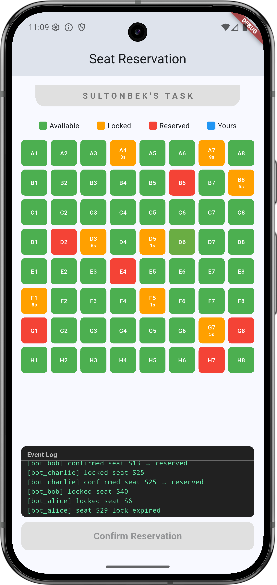
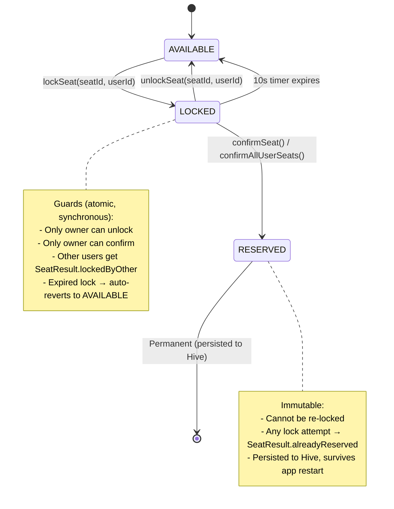

# Real-Time Seat Reservation System

A Flutter application that simulates a real-time cinema seat reservation system with concurrency handling, timeout logic, and race condition prevention.

## Demo

<p align="center">
  
</p>

## Architecture

```
lib/
├── config/
│   ├── app_constants.dart      # Default 64 seats
│   └── enum.dart               # SeatStatus, SeatResult
├── data/
│   └── local/
│       └── seat_local_storage.dart  # Hive persistence (reserved IDs only)
├── domain/
│   ├── model/
│   │   └── seat/
│   │       └── seat_model.dart      # Freezed seat model
│   └── service/
│       ├── seat_manager.dart        # Core business logic (single source of truth)
│       └── background_simulator.dart # Bot user simulation
├── presentation/
│   ├── bloc/
│   │   └── home/
│   │       ├── home_bloc.dart       # Thin dispatcher (no business logic)
│   │       ├── home_event.dart
│   │       └── home_state.dart
│   └── screen/
│       └── home_screen.dart         # UI with countdown + log panel
├── app.dart
└── main.dart
```

## Seat State Machine



```
  ┌─────────────────────────────────────────────────────────────────────┐
  │                         VALID TRANSITIONS                          │
  ▼                                                                    │
┌───────────┐    lockSeat(id, uid)      ┌──────────┐                   │
│ AVAILABLE │ ────────────────────────▶ │  LOCKED   │                   │
└───────────┘                           │ lockedBy  │                   │
      ▲                                 │ expiry=10s│                   │
      │                                 └──────────┘                   │
      │    unlockSeat(id, uid)             │  │  │                     │
      ├────────────────────────────────────┘  │  │                     │
      │    _expireSeat (10s timer)            │  │                     │
      ├───────────────────────────────────────┘  │                     │
      │                           confirmSeat()  │                     │
      │                                          ▼                     │
      │                                    ┌──────────┐                │
      │                                    │ RESERVED │                │
      │                                    │ (Hive)   │                │
      │                                    └──────────┘                │
      │                                          │  on app restart     │
      │                                          │  restored from Hive │
      └──────────────────────────────────────────┘                     │
                                                                       │
  ┌─────────────────────────────────────────────────────────────────────┘
  │                     REJECTED TRANSITIONS (Race Condition Guards)
  │
  │  User A tries lockSeat("S5") while User B holds it
  │  ├── LOCKED by B → return SeatResult.lockedByOther     ✗ REJECTED
  │
  │  User A tries lockSeat("S5") which is RESERVED
  │  ├── RESERVED → return SeatResult.alreadyReserved      ✗ REJECTED
  │
  │  User A tries confirmSeat("S5") but lock expired
  │  ├── Timer already fired → SeatStatus.available
  │  └── confirmSeat finds AVAILABLE → SeatResult.notLocked ✗ REJECTED
  │
  │  User A rapid-taps "S5" 100 times
  │  ├── handleSeatTap reads LIVE state each call
  │  └── lock→unlock→lock→unlock... never corrupts         ✓ SAFE
  │
  │  3 bot users + 1 real user all target same seat
  │  ├── Synchronous lockSeat → first caller wins
  │  └── Others get lockedByOther                           ✓ SAFE
```

### Transition Rules

| From | To | Trigger | Guard |
|---|---|---|---|
| AVAILABLE | LOCKED | `lockSeat(seatId, userId)` | Seat must be AVAILABLE |
| LOCKED | AVAILABLE | `unlockSeat(seatId, userId)` | Must be locked by same userId |
| LOCKED | AVAILABLE | Timer (10s) | Automatic — no user action |
| LOCKED | RESERVED | `confirmSeat(seatId, userId)` | Same userId + not expired |
| LOCKED | RESERVED | `confirmAllUserSeats(userId)` | Batch — checks expiry per seat |

### Race Condition Prevention

#### Why no `async/await` in SeatManager — and why that matters

Dart is single-threaded, but that alone doesn't prevent race conditions. The key is **where you yield control**. Every `await` is a yield point — the event loop can run other code (timers, stream callbacks, BLoC events) between the lines before and after `await`:

```dart
// DANGEROUS — async version (we do NOT do this)
Future<SeatResult> lockSeat(String seatId, String userId) async {
  final seat = _seats[index];            // 1. Read state
  if (seat.status != SeatStatus.available) return SeatResult.lockedByOther;

  await _storage.saveLock(seatId);        // 2. await = YIELD POINT
                                          //    ↑ timer fires here, bot calls lockSeat,
                                          //    another event processes — state changes!

  _seats[index] = seat.copyWith(          // 3. Write based on STALE read from step 1
    status: SeatStatus.locked,            //    = RACE CONDITION: double-lock possible
    lockedBy: userId,
  );
}
```

Between step 1 (check) and step 3 (update), the `await` lets the event loop run other code. A bot timer could fire and lock the same seat, or the expiration timer could reset it. Step 3 then overwrites that change — **two users end up "locking" the same seat**.

```dart
// SAFE — our actual synchronous version
SeatResult lockSeat(String seatId, String userId) {
  final seat = _seats[index];            // 1. Read state
  if (seat.status != SeatStatus.available) return SeatResult.lockedByOther;

  _seats[index] = seat.copyWith(          // 2. Write IMMEDIATELY — no yield point
    status: SeatStatus.locked,            //    No other code can run between 1 and 2
    lockedBy: userId,                     //    = ATOMIC: check + update is one unit
  );
  _startExpirationTimer(seatId);
  _emit();
  return SeatResult.success;
}
```

No `await` = no yield point = **check and update execute as one uninterruptible unit**. Even with 3 aggressive bots firing every 0.8s, the event loop must finish the current `lockSeat()` call entirely before processing the next one.

#### Stale data in BLoC events

The second race condition vector is the BLoC event queue itself:

```
UI dispatches event with SeatModel snapshot at time T
    ↓
BLoC queue processes event at time T+N
    ↓
Seat state may have changed (bot locked it, timer expired, etc.)
    ↓
Decision based on stale snapshot = RACE CONDITION
```

**Solution: Events carry only `seatId`, SeatManager reads live state**
```
UI dispatches event with seatId only (no snapshot)
    ↓
BLoC delegates to SeatManager.handleSeatTap(seatId, userId)
    ↓
SeatManager reads _seats[index] — LIVE state at execution time
    ↓
Synchronous check + update = ATOMIC, no interleaving possible
```

#### What if async was required?

If this system had a real backend or async database, synchronous methods wouldn't be possible. The `await` would create a yield point where other code could interleave. But since Dart is single-threaded, a simple class-level `bool` flag is enough to guard the critical section:

```dart
class SeatManager {
  bool _isBusy = false;  

  Future<SeatResult> lockSeat(String seatId, String userId) async {
    if (_isBusy) return SeatResult.busy;   
    _isBusy = true;                       
    try {
      final seat = _seats[index];
      if (seat.status != SeatStatus.available) return SeatResult.lockedByOther;

      await _api.lockSeat(seatId, userId);  

      _seats[index] = seat.copyWith(
        status: SeatStatus.locked,
        lockedBy: userId,
      );
      return SeatResult.success;
    } finally {
      _isBusy = false;                  
    }
  }
}
```

Why this works in Dart but not in Java/Go:
- Dart is **single-threaded** — `if (_isBusy)` check + `_isBusy = true` is synchronous, no thread can preempt between them
- In multi-threaded languages, two threads could both read `_isBusy == false` simultaneously — that's why they need `Mutex`, `synchronized`, or atomic operations
- In Dart, the only place control can switch is at `await` — and by that point the flag is already set

A full `Mutex` with `Completer` queue is overkill for Dart. It's a pattern from multi-threaded languages. In Dart, a simple boolean guard achieves the same safety with less complexity.

**We chose the synchronous approach** because all logic is local (no backend). This eliminates even the need for a boolean flag — simpler, faster, and impossible to break.

#### Summary

| Layer | Race condition vector | Prevention |
|---|---|---|
| SeatManager | TOCTOU (check-then-act gap) | All mutations are synchronous — no `await` between read and write |
| BLoC events | Stale `SeatModel` snapshot in event | Events carry only `seatId`, SeatManager reads live `_seats` list |
| Batch confirm | Per-seat persist + emit in loop | `confirmAllUserSeats` — single pass, single persist, single emit |
| UI → BLoC | Multiple rapid taps queued | `handleSeatTap` reads live state per call, not cached from event |
| Background bots | 3 bots + user competing | Synchronous `lockSeat` — first caller wins, others rejected atomically |
| Async fallback | `await` yield points in mutations | Mutex serializes access — one operation at a time |

## Running

```bash
flutter pub get
flutter run
```

## Testing

```bash
flutter test test/seat_manager_test.dart
```

34 tests covering: lock/unlock/confirm transitions, expiration timers (via `fakeAsync`), stream emissions, log stream, and race condition scenarios.
