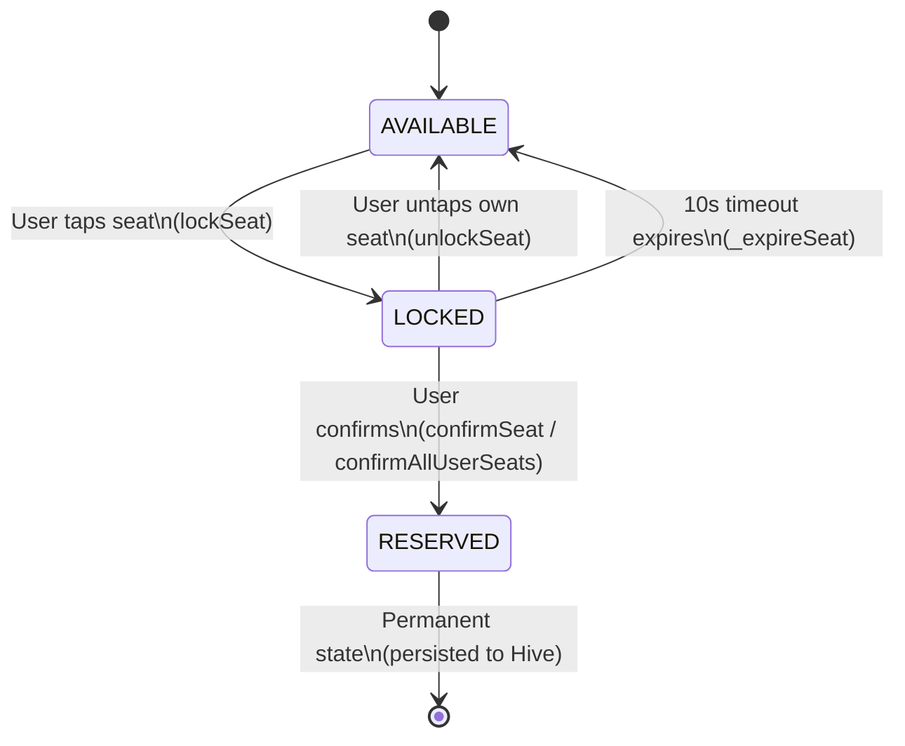

# Real-Time Seat Reservation System

A Flutter application that simulates a real-time cinema seat reservation system with concurrency handling, timeout logic, and race condition prevention.

## Architecture

```
lib/
├── config/
│   ├── app_constants.dart      # Default 64 seats
│   └── enum.dart               # SeatStatus, SeatResult
├── data/
│   └── local/
│       └── seat_local_storage.dart  # Hive persistence (reserved IDs only)
├── domain/
│   ├── model/
│   │   └── seat/
│   │       └── seat_model.dart      # Freezed seat model
│   └── service/
│       ├── seat_manager.dart        # Core business logic (single source of truth)
│       └── background_simulator.dart # Bot user simulation
├── presentation/
│   ├── bloc/
│   │   └── home/
│   │       ├── home_bloc.dart       # Thin dispatcher (no business logic)
│   │       ├── home_event.dart
│   │       └── home_state.dart
│   └── screen/
│       └── home_screen.dart         # UI with countdown + log panel
├── app.dart
└── main.dart
```

## Seat State Machine



```
              ┌──────────────────────────────────────┐
              │                                      │
              ▼                                      │
        ┌───────────┐    lockSeat()     ┌─────────┐  │
  ──▶   │ AVAILABLE │ ───────────────▶  │ LOCKED  │  │
        └───────────┘                   └─────────┘  │
              ▲                           │  │  │    │
              │         unlockSeat()      │  │  │    │
              ├───────────────────────────┘  │  │    │
              │        _expireSeat()         │  │    │
              ├──────────────────────────────┘  │    │
              │                                 │    │
              │                  confirmSeat()  │    │
              │                                 ▼    │
              │                          ┌──────────┐│
              │                          │ RESERVED ││
              │                          └──────────┘│
              │                                      │
              │          (on app restart,             │
              │           reserved seats restored     │
              │           from Hive)                  │
              └──────────────────────────────────────┘
```

### Transition Rules

| From      | To        | Trigger                          | Guard                                  |
|-----------|-----------|----------------------------------|----------------------------------------|
| AVAILABLE | LOCKED    | `lockSeat(seatId, userId)`       | Seat must be AVAILABLE                 |
| LOCKED    | AVAILABLE | `unlockSeat(seatId, userId)`     | Must be locked by same user            |
| LOCKED    | AVAILABLE | Timer (10s)                      | Automatic expiration                   |
| LOCKED    | RESERVED  | `confirmSeat(seatId, userId)`    | Must be locked by same user, not expired |
| LOCKED    | RESERVED  | `confirmAllUserSeats(userId)`    | Batch confirm, checks expiry per seat  |

### Race Condition Prevention

All state mutations in `SeatManager` are **synchronous** — no `await` between check and update. This leverages Dart's single-threaded event loop to guarantee atomic transitions:

- `handleSeatTap(seatId, userId)` — reads **live** state (not stale UI snapshot) for toggle decision
- `confirmAllUserSeats(userId)` — single pass, single persist, single stream emit
- Events carry only `seatId` (not `SeatModel`) to prevent stale data decisions in BLoC

## Running

```bash
flutter pub get
flutter run
```

## Testing

```bash
flutter test test/seat_manager_test.dart
```

34 tests covering: lock/unlock/confirm transitions, expiration timers (via `fakeAsync`), stream emissions, log stream, and race condition scenarios.
